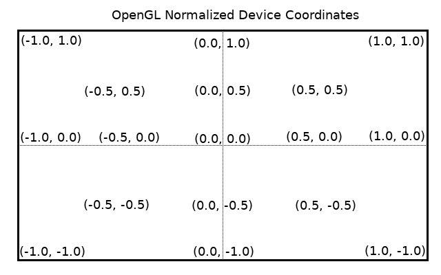

Rendering stuff using modern OpenGL
===================================
1. Generate an object ID for OpenGL

        unsigned int objectId = 0;
        glGenObject(1, &objectId);

2. Bind the object ID to the thing you're working with

        glBindObject(GL_WINDOW_TARGET, objectId);

3. Set the options for the thing you're working with

        glSetObjectOption(GL_WINDOW_TARGET, GL_OPTION_WINDOW_WIDTH, 800);
        glSetObjectOption(GL_WINDOW_TARGET, GL_OPTION_WINDOW_HEIGHT, 600);

4. Unbind the object ID from the thing

        glBindObject(GL_WINDOW_TARGET, 0);

Set the viewport
----------------
`glViewport(GLint x, GLint y, GLsizei width, GLsizei height)`  
Example: `glViewport(0, 0, 800, 600)`

Graphics pipeline steps
=======================
1. Vertices have vertex attributes
2. The vertex shader takes these attributes and manipulates them
3. The OpenGL implementation (graphics driver) assembles primitives given the vertex data from the vertex shader and hints about it e.g. primitive type.
4. The primitives are sent to the geometry shader if it is available. The geometry shader does stuff like tesselation
5. The GPU calculates all of the data needed in order to display a pixel (a fragment)
6. The fragments are sent to the fragment shader, which calculates the pixel colour and clips stuff out of view
7. The rendered object is blended in with the scene

Normalized device coordinates
=============================

Vertex Buffer Objects
=====================
Use VBOs to manage the vertex data being sent to the GPU  
`glGenBuffers(x, vBufID)`  
will allocate vertex buffer objects, and return the IDs of the allocated buffers.  
`glBindBuffer(GL_ARRAY_BUFFER, vBufID)`  
will set the buffer with vBufID to be an "array buffer"  
`glBufferData(GL_ARRAY_BUFFER, sizeof(vertices), vertices, GL_STATIC_DRAW)`  
will upload the data from the "vertices" array to the GPU. (I think)  
GL_STATIC_DRAW makes the data harder to write to, but faster to render if it doesn't change  
GL_DYNAMIC_DRAW or GL_STREAM_DRAW makes the data easier to write to  

Shaders
=======
For modern rendering pipelines, which give more control over what is rendered, vertex and fragment shaders are required.  
Declare inputs at the top of vertex and fragment shaders using `layout (location = 0) in vec3 aPos;` for example  
Shaders first have to be compiled, and then one or more shader(s) are linked into a shader program  

    unsigned int vertexShader;
    vertexShader = glCreateShader(shaderType); // Create shader
    glShaderSource(vertexShader, 1, &vertexShaderSource, &vertexShaderSize); // Assign source to shader
    glCompileShader(vertexShader); // Compile the shader
Once the shaders are ready to be used, link them into a program  

    unsigned int shaderProgram;
    shaderProgram = glCreateProgram();
    glAttachShader(shaderProgram, vertexShader);
    glAttachShader(shaderProgram, fragmentShader);
    glLinkProgram(shaderProgram);
In the code that renders the scene: `glUseProgram();`  
After you're done with the shaders: `glDeleteShader(shaderId);`  

GLSL
----
This is the language used to write 'shaders' (programs which manipulate vectors) for OpenGL. A shader always begins with a version number and has a main() function. You can also pass various data to/from the shader using ins, outs, and uniforms.

Each input variable to a vertex shader is a vertex attribute. Here's how you can get the maximum number of vertex attributes the hardware supports:

    int nrAttributes;
    glGetIntegerv(GL_MAX_VERTEX_ATTRIBS, &nrAttributes);

GLSL has integer, unsigned integer, floating point, and boolean types in addition to vector types corresponding to each of the previous types. Vectors' components can be accessed using XYZW for 3D coordinates, or RGBA for colours, or STPQ for UV coordinates. Each of these "coordinate systems" are completely interchangeable.

You can do swizzling by randomly choosing components of one vector to be used as the components of another. Just don't forget that you can't access the z/b/p component of a 2D vector or the w/a/q component of a 3D vector.

You can send data from one shader to another using in/out variables with the same name. In the following example, vertexColor is set in the vertex shader, and received by the fragment shader.  
This is the vertex shader:

    #version 330 core
    layout (location = 0) in vec3 aPos; // the position variable has attribute position 0

    out vec4 vertexColor; // specify a color output to the fragment shader

    void main()
    {
        gl_Position = vec4(aPos, 1.0); // see how we directly give a vec3 to vec4's constructor
        vertexColor = vec4(0.5, 0.0, 0.0, 1.0); // set the output variable to a dark-red color
    }

And this is the fragment shader:

    #version 330 core
    out vec4 FragColor;
    
    in vec4 vertexColor; // the input variable from the vertex shader (same name and same type)  

    void main()
    {
        FragColor = vertexColor;
    }

You can also send data into the shader from the CPU by using uniforms. Uniforms are global for each shader program (a vertex and fragment shader linked together).  
Uniforms must be queried and set AFTER the shader program is linked, and uniforms can be updated in the render loop. This is how:

    // Calculate uniform value (for example, a pulsating shade of green based on how much time the app has been running)
    float timeValue = glfwGetTime();
    float greenValue = (std::sin(timeValue) / 2.0f) + 0.5f;

    // Assign uniform value to the "ourColor" uniform
    // which was declared in the fragment shader by this line:
    // uniform vec4 ourColor;
    int vertexColorLocation = glGetUniformLocation(shaderProgram, "ourColor");

    // Activate the shader program
    glUseProgram(shaderProgram);
    if (vertexColorLocation >= 0)
    { // Ensure uniform is valid before updating it
        // NOW set the uniform
        glUniform4f(vertexColorLocation, 0.0f, greenValue, 0.0f, 1.0f);
    }

The name of an OpenGL function to set specific uniforms generally has the form `glUniform(1|2|3|4)(f|i)`, where f/i is the type and 1/2/3/4 is the number of parameters the function takes.

Vertex buffers
==============
These are usually arrays that store the vertex data, including attributes like XYZ coordinates, XYZ normals, UV coordinates, etc. You can store vertices as either 2 or 3 contiguous floats at once, depending on whether you're drawing in 2D or 3D.

Vertex array objects
====================
This is a way to store the configurations for vertex buffer attributes. In order to use it, put glGenVertexArrays(VAO) before the code that sets up the vertex buffers and their respective attributes, and put glBindVertexArray(VAO) when you are done setting up the aforementioned data.

    unsigned int VAO;
    glGenVertexArrays(1, &VAO);

    // Bind the Vertex Array Object during setup so that the following OpenGL state changes are recorded in the VAO
    glBindVertexArray(VAO);

    unsigned int VBO;
    glGenBuffers(1, &VBO);
    // Render this sh!t
    glBindBuffer(GL_ARRAY_BUFFER, VBO);
    glBufferData(GL_ARRAY_BUFFER, sizeof(vertices), vertices, GL_STATIC_DRAW);

    // Give OpenGL information about how the vertex buffer data is presented
    glVertexAttribPointer(0, 3, GL_FLOAT, GL_FALSE, sizeof(float) * 3, (void*)0);
    glEnableVertexAttribArray(0);

    // Release the bindings once setup is complete
    glBindBuffer(GL_ARRAY_BUFFER, 0);
    glBindVertexArray(0);

Vertex attribute pointers
=========================
For vertex buffers containing more than one attribute, such as both positions and colours, you need to add more vertex attribute pointers.

An offset is the number of bytes from the start of the buffer where the data begins.  
A stride is the number of bytes separating the first bytes of each individual element.  

Note that offsets and strides are given to glVertexAttribPointer in *bytes*, not elements, so use sizeof(float) * e where e is the number of floats per element to calculate the strides and offsets.

As for an example of how to do this:

    glVertexAttribPointer(1, 3, GL_FLOAT, GL_FALSE, sizeof(float) * 3, (void*) (3 * sizeof(float)) );

As for why the second attribute is the colour? The vertex shader decides what to do with it.  
The arguments for glVertexAttribPointer are as follows:  
`glVertexAttribPointer(arrayIndex, numElements, elementType, normalized, stride, offset);`

Drawing stuff (FINALLY!!!)
==========================
In the render loop:

1. Bind the shader program for the stuff you want to draw: `glUseProgram(shaderProgram);`
2. Bind the vertex array for the thing you want to draw: `glBindVertexArray(VAO);`
3. Call the function to draw the vertex array: `glDrawArrays(GL_TRIANGLES, 0, x);` where x is the number of vertices

Element Buffer Objects
======================
An element buffer object is a way to make OpenGL use the indices of the vertices in the buffer, in order to help prevent repetition of data in the vertex buffer.
Here is a vertex buffer and an element buffer for a rectangle with 4 vertices:

    // Vertex buffer
    float vertices[] = {
        0.5,  0.5, 0.0,  // top right
        0.5, -0.5, 0.0,  // bottom right
        -0.5, -0.5, 0.0,  // bottom left
        -0.5,  0.5, 0.0   // top left 
    };
    // Element buffer
    unsigned int indices[] = {  // note that we start from 0!
        0, 1, 3,   // first triangle
        1, 2, 3    // second triangle
    };

To upload it to the GPU:

    unsigned int EBO;
    glGenBuffers(1, &EBO);
    glBindBuffer(GL_ELEMENT_ARRAY_BUFFER, EBO);
    glBufferData(GL_ELEMENT_ARRAY_BUFFER, sizeof(indices), indices, GL_STATIC_DRAW);

Maybe release the binding afterwards: `glBindBuffer(GL_ELEMENT_ARRAY_BUFFER, 0);`  
Use `glDrawElements(GL_TRIANGLES, x, GL_UNSIGNED_INT, 0);` to draw using both a VAO and an EBO, where x is the number of vertices to draw. Don't forget to bind the vertex array object before you do!

Drawing modes
=============
The drawing mode specifies how your polygons should be drawn. GL_FILL is the default drawing mode.  
`glPolygonMode(GL_FRONT_AND_BACK, GL_FILL);`  
In order to draw your polygons as a wireframe, set glPolygonMode to GL_LINE instead of GL_FILL.  
`glPolygonMode(GL_FRONT_AND_BACK, GL_LINE);`  
In order to draw your polygons as a point cloud, set glPolygonMode to GL_POINT.  
`glPolygonMode(GL_FRONT_AND_BACK, GL_POINT);`  

OpenGL version and rendering device
===================================
To get the OpenGL version currently being used, as well as what is doing the rendering:

    const char* renderer = glGetString(GL_RENDERER);
    const char* glversion = glGetString(GL_VERSION);
    std::cout << "Renderer: " << renderer << std::endl << "OpenGL Version: " << glversion << std::endl;

Texturing
=========
Textures are images that are mapped to the polygons that make up a 3D model.

The images have to be loaded from image files, then uploaded to the GPU, and put into texture units. There may be more than one texture unit per object.

sampler2D uniforms in the shaders are always set to texture unit 0 by default. Use glUniform1i to set the texture unit for the sampler2D to something other than 0.

I noticed that you have to set the texture units for the sampler2D uniforms for every frame you render. However, the solutions to the OpenGL tutorials do not do it that way, but instead they set the texture units BEFORE the render loop. Maybe it's a problem or a quirk with NVidia's drivers?

Textures can have smaller versions of themselves called mipmaps. This allows textures to scale down neatly at a distance.

To prepare a texture:

1. Load the image file for the texture
2. Allocate the texture using `glGenTextures(1, &texture);`
3. Set the texture's texture unit using `glActiveTexture(GL_TEXTURE0-15);`
3. Bind the texture using `glBindTexture(GL_TEXTURE_2D, texture);`
4. Upload the texture to the GPU using `glTexImage2D(GL_TEXTURE_2D, curLod, internalFormat, width, height, 0, dataFormat, dataType, data);
5. Set up the texture using `glTexParameteri(GL_TEXTURE_2D, paramToSet, paramValue);`
6. Optionally generate mipmaps for the texture using `glGenerateMipmap(GL_TEXTURE_2D);`

To render an object using two textures:

1. Use `glActiveTexture(GL_TEXTURE0-15);` to set the active texture unit
2. Use `glBindTexture(GL_TEXTURE_2D, textureId);` to put the texture into the texture unit

Delete textures using `glDeleteTextures(x, ptxIds);`

Transformations
===============

Transformations are done using matrices. A matrix can be multiplied by a vector to make a completely new vector. See KHAAAAAAN.txt for more info on matrices and matrix math.

Pass a matrix as a uniform to a GLSL shader by doing this:

    void setMatrixUniform (const char* name, float* mtx) {
    ...
    int uniformLocation = getUniformLocation(name);
    glUniformMatrix4fv(uniformLocation, 1, GL_FALSE, mtx);
    }

OpenGL matrices are in column-major order rather than row-major order, so you will need to replace GL_FALSE with GL_TRUE if the matrix is in row-major order.

These transformations are used to take vertices (that are part of objects) in the 3D world, and put them into normalized device (screen) coordinates. It works like this:

1. Vertices are taken from local space (relative to the object, which has an XYZ position), and put into world space
2. Vertices are taken from world space, and put into view space
3. Vertices are *culled* by projecting a clip matrix onto them
4. The remaining vertices are projected into view space again

OpenGL has no concept of a camera, so in order to simulate a camera, you move everything in the entire scene instead. Do this by passing your world->NDC matrix chain as uniforms to your shader program.